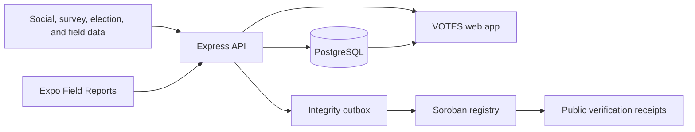

<div align="center">
  

  # VOTES

  ### Local and regional public-opinion intelligence

  **Understand communities. Track sentiment. Verify evidence.**

  VOTES brings community field reports, surveys, historical elections, and social-listening data into one geographic-intelligence platform for local and regional decision support in the Philippines.

  [Explore the platform](#-platform-at-a-glance) · [Run locally](#-run-locally) · [Mobile field reports](mobile/README.md) · [Integrity guide](docs/soroban-integrity.md) · [Data policy](docs/data-sources.md)

  
  
  
  
  
</div>

> [!IMPORTANT]
> VOTES is a prototype. Dashboard figures are illustrative unless a view explicitly identifies a live source. All Stellar integrity features documented here target Testnet.

---

## 📡 Why VOTES

Local public opinion rarely lives in one dataset. Community issues, survey results, election history, social signals, and reports from the field all arrive with different geographic boundaries, confidence levels, and update cycles.

VOTES gives teams one place to compare those signals while keeping administrative geography separate from electoral geography and making source and confidence boundaries visible.

## 🧭 Platform at a Glance

| Experience | What it helps teams do | Current state |
| --- | --- | --- |
| 📍 **VOTES Dashboard** | Explore local and regional sentiment, issues, timelines, and election context by province, congressional district, LGU, and community | Multi-workspace prototype with live-source integration boundaries |
| 📱 **Field Reports** | Capture observations, coordinates, and photo evidence; queue drafts and synchronize selected reports | Expo client with connected and offline prototype modes |
| 🛡️ **Integrity** | Anchor report revisions, attestations, and reusable data artifacts without publishing sensitive content on-chain | Soroban contract and operational pipeline; Testnet by default |
| 🔐 **Administration** | Control tenant/workspace access, roles, review queues, sessions, and integrity operations | Authenticated web workflows |

## ✨ What You Can Do Today

- Navigate regional and local overview, sentiment, issue, location, timeline, historical, and key-insight views.
- Switch between administrative and electoral viewing modes with cascading, location-ready filters.
- Review source coverage, demo-data labels, confidence indicators, and geographic provenance.
- Collect field reports on mobile with camera/library evidence, foreground GPS, drafts, an offline outbox, selective synchronization, and retry states.
- Review synchronized reports in the web application and verify their ordered integrity history.
- Register survey schemas and batches, dataset snapshots, analytics outputs, AI attestations, configuration approvals, and release evidence as reusable integrity artifacts.

## 🧩 How It Fits Together



PostgreSQL remains the operational source of truth. The integrity layer writes only opaque keys, revision and schema metadata, and SHA-256 commitments to Soroban; report text, identities, locations, filenames, and attachment contents remain off-chain.

## 🌍 Geography and Data Model

Administrative and electoral geography are intentionally modeled as separate hierarchies:

| Mode | Hierarchy |
| --- | --- |
| Administrative | Country → region → province/HUC → city or municipality → barangay |
| Electoral | Election cycle → congressional district → member localities/barangays |

Every geographic record should carry stable IDs, official codes, effective dates, a source version, and boundary provenance. The next data milestone is broader integration with the PSA Philippine Standard Geographic Code (PSGC), followed by a separately versioned congressional-district mapping.

The implementation-ready ingestion and source policy is in [`docs/data-sources.md`](docs/data-sources.md). Prefer official APIs, bulk downloads, and publisher-provided feeds. Public visibility alone does not authorize scraping; every connector requires terms, robots, licensing, privacy, and retention review.

## 🛠️ Tech Stack

| Layer | Technologies |
| --- | --- |
| Web | React 19, TypeScript, Vite, React Router, Recharts |
| API | Node.js, Express, PostgreSQL |
| Mobile | Expo and React Native |
| Integrity | Stellar SDK, Soroban, Rust/Wasm, SHA-256 commitments |
| Operations | Docker Compose, nginx, systemd, GitHub Actions |

## 🚀 Run Locally

### Prerequisites

- Node.js 22 (recommended) and npm
- PostgreSQL when using database-backed workflows
- Rust and the Stellar CLI only when building or testing the Soroban contract

### 1. Install and start the web workspace

From the repository root:

```bash
npm install
npm run dev
```

The Vite client runs on `http://localhost:5173`, and the API runs on `http://localhost:8787`. Vite proxies `/api` requests to the local API.

To use an API hosted elsewhere, create `.env` in the repository root and set:

```dotenv
VITE_API_BASE_URL=https://your-api.example.com
```

### 2. Configure optional data services

Copy the backend environment template:

```bash
cp backend/.env.example backend/.env
```

Add the services required for the workflow you are exercising. For PSGC integration, for example:

```dotenv
PSA_PSGC_TOKEN=your-token
PSA_PSGC_VERSION=Q2_2024
```

For a PostgreSQL-backed environment, configure `DATABASE_URL`, then apply migrations before starting the API:

```bash
npm run db:migrate
```

### 3. Start the Field Reports app

```bash
npm --prefix mobile install
npm run mobile:start
```

Without `EXPO_PUBLIC_API_BASE_URL`, the app uses local prototype persistence. Set the variable to an API address reachable by the device to enable authenticated synchronization with the web review queue. See the [mobile guide](mobile/README.md) for device networking, authentication, EAS builds, and privacy notes.

## 🐳 Run the API with Docker

After creating `backend/.env`, build and start the API:

```bash
docker compose up --build -d api
```

Compose runs the idempotent database migration service before the API, including the report-integrity, audit, artifact, incident, reconciliation, and event-ingestion tables.

Verify the service:

```bash
docker compose ps
curl http://127.0.0.1:8787/api/health
curl http://127.0.0.1:8787/api/geography/regions
```

On Linux, the API service uses host networking so a `DATABASE_URL` containing `localhost:5432` can connect to PostgreSQL on the host. PostgreSQL remains bound to loopback. Local Compose enables the prototype mobile account explicitly; do not enable `MOBILE_AUTH_PROTOTYPE_ONLY` in a public or production deployment.

```bash
docker compose logs -f api
docker compose down
```

## 🔗 Stellar and Soroban Integrity

VOTES uses Soroban as a privacy-preserving verification layer around field reports and reusable artifacts.

### Current Testnet Contracts

| Contract | Address | Explorer |
| --- | --- | --- |
| `ReportIntegrity` v2 | `CCSUQUHI3U25WIZFDODQDC7T4MGKRVAIXVQVIITESQDFYAGMQ6J5KFFA` | [View on Stellar Expert](https://stellar.expert/explorer/testnet/contract/CCSUQUHI3U25WIZFDODQDC7T4MGKRVAIXVQVIITESQDFYAGMQ6J5KFFA) |

The v2 contract was deployed in transaction [`46170d73ad57b8b42589353b624f5796a61d14098c5c188664cc73d0d07e05ef`](https://stellar.expert/explorer/testnet/tx/46170d73ad57b8b42589353b624f5796a61d14098c5c188664cc73d0d07e05ef) from Wasm SHA-256 `e57084894fa1198afaf7bf3b6ca4ed12b3d5657d2abfe7ae0aed4d9be26babc4`.

> [!NOTE]
> The earlier v1 Testnet contract remains available at [`CDKAQYQKVN3RVMWRO5MH6EMRRBOHBBOW37ZEFEPSY4WTBMDAKVYUNCTQ`](https://stellar.expert/explorer/testnet/contract/CDKAQYQKVN3RVMWRO5MH6EMRRBOHBBOW37ZEFEPSY4WTBMDAKVYUNCTQ) only for verification of its existing anchors. If v2 is redeployed, update this table, `backend/.env.example`, and [`contracts/README.md`](contracts/README.md) together.

| Control | Implementation |
| --- | --- |
| Authorization | Separate administrator and writer roles |
| Report history | Immutable submissions, ordered evidence revisions, and review attestations |
| Delivery | Transactional outbox, atomic claims, bounded retries, and recovery of uncertain submissions |
| Verification | Confirmed transaction/ledger references, chain validation, reconciliation, and privacy-safe `/verify/:receipt` pages |
| Operations | TTL renewal, event ingestion, durable incidents, alerts, off-site event archiving, and archived-state restoration tooling |
| Data artifacts | Provenance commitments, Merkle batches, inclusion proofs, publisher/observer attestations, and multi-party release gates |

The artifact endpoint accepts either a JSON payload for deterministic server-side hashing or an existing lowercase SHA-256 digest for files and external datasets. Public verification must be enabled per artifact; private artifacts remain available only to authorized operators.

Read [`docs/soroban-integrity.md`](docs/soroban-integrity.md) for the threat model, privacy boundary, API routes, Testnet configuration, and operational controls. Contract-specific build, test, and deployment instructions are in [`contracts/README.md`](contracts/README.md).

## 🧪 Test and Validate

Run the complete release gate:

```bash
npm run test:release
```

Or run focused checks:

```bash
npm run type-check
npm run mobile:type-check
npm run test:reports
npm run test:integrity
npm run contract:test
npm run build
```

The GitHub Actions integrity gate repeats the report, integrity, type, contract, lint, Wasm-build, and web-build checks for relevant pull requests and pushes.

## 📦 Repository Map

```text
.
├── frontend/          # React web application for VOTES
├── backend/           # Express API, PostgreSQL access, workers, and scripts
├── mobile/            # Expo Field Reports client
├── shared/            # Contracts shared by web, API, and mobile
├── contracts/         # Soroban report-integrity contract
├── data/              # Versioned and cached geography/election inputs
├── docs/              # Data, integrity, cost, and release documentation
├── deploy/            # nginx and systemd deployment configuration
└── compose.yaml       # Local API/database workflow
```

## 📚 Documentation

- [Field Reports mobile](mobile/README.md) — offline/connected behavior, API boundary, builds, and privacy notes.
- [Data sources](docs/data-sources.md) — acquisition, licensing, provenance, normalization, and refresh policy.
- [Soroban integrity](docs/soroban-integrity.md) — architecture, APIs, operational controls, and deployment gates.
- [Contract guide](contracts/README.md) — contract interface, build, test, and deployment details.
- [Backend cost estimate](docs/backend-cost-estimate.md) — infrastructure assumptions and estimates.

## ⚠️ Prototype Boundaries

- Most dashboard values remain illustrative until a view identifies an integrated source and version.
- Geographic records and congressional mappings are still being expanded and versioned.
- Field reports may contain sensitive attachments, coordinates, or statements and require an approved purpose, consent, access, encryption, upload-limit, and retention policy before production use.
- Testnet integrity is intended for development, testing, and demonstration rather than production security, custody, or compliance assurance.

## 🤝 Contributing

Keep changes focused, preserve the separation between administrative and electoral geography, and add tests beside changed behavior. Before opening a pull request, run the relevant focused checks or the full release gate:

```bash
npm run test:release
```

Include screenshots for visible interface changes and update the corresponding document when changing data provenance, integrity behavior, environment configuration, or deployment controls.
