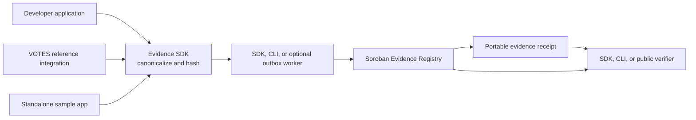

<div align="center">
  

  # VOTES

  ### Stellar Evidence Kit

  **Public-opinion intelligence with a proposed open-source Soroban developer toolchain for verifiable evidence.**

  VOTES is a geographic-intelligence platform and the first reference implementation of the proposed Stellar Evidence Kit: a generic Soroban contract, TypeScript SDK, CLI, and public verifier for privacy-preserving off-chain evidence.

  [VOTES platform](#-votes-platform--reference-integration) · [Proposed deliverables](#-proposed-30-day-deliverables) · [Current baseline](#-current-technical-baseline) · [Run VOTES](#-run-votes-and-the-current-integrity-baseline) · [Integrity guide](docs/soroban-integrity.md)

  
  
  
  
  
</div>

> [!IMPORTANT]
> This repository serves two connected purposes: it contains the VOTES application and its working Testnet integrity implementation, and it is the source baseline for the proposed Stellar Evidence Kit extraction. The standalone toolkit packages have not yet been published. No open-source license has been selected yet, and Mainnet deployment is out of scope.

---

## 🗳️ VOTES and the Stellar Evidence Kit

| Name | Role in this repository | Status |
| --- | --- | --- |
| **VOTES** | Local and regional public-opinion intelligence with web, mobile field-reporting, geographic analysis, administration, and Soroban-backed evidence verification | Working prototype and reference application |
| **Stellar Evidence Kit** | Reusable Soroban contract, TypeScript SDK, CLI, receipt verifier, examples, and developer documentation extracted from the VOTES integrity implementation | Proposed 30-day Instaward deliverable |

Stellar developers who need tamper-evident records currently have to design commitment formats, build and deploy Soroban contracts, manage authorization and transaction lifecycles, and create independent verification themselves. That duplicates effort and makes privacy boundaries, ordered revisions, retries, TTL maintenance, batching, and portable receipts difficult to implement consistently.

The proposed toolkit will provide a reusable path from a private off-chain record to a public, independently verifiable Soroban receipt. Applications keep their source data and business logic off-chain; Stellar receives only opaque identifiers, schema and revision metadata, and cryptographic commitments.

The ecosystem outcome is deliberately broader than VOTES: a developer unfamiliar with this application should be able to install the package, connect to or deploy the contract, commit a file or JSON payload hash, and verify the resulting receipt without importing VOTES code.

## 🎯 Proposed 30-Day Deliverables

| Deliverable | Sprint output | Completion evidence |
| --- | --- | --- |
| **1. Generic Soroban Evidence Registry & Specification** | Generalize the current Rust/Wasm contract; define stable evidence-envelope and receipt formats; add an explicit open-source license and deployment guide | Licensed source, passing contract tests, Testnet contract ID, deployment transaction, and confirmed commit/revision/TTL transactions |
| **2. TypeScript SDK, CLI & Transaction Workflow** | Publish framework-neutral commitment, submission, receipt, lookup, verification, Merkle-batch, and proof APIs; provide a CLI and optional asynchronous outbox example | Installable package, CLI, API documentation, automated tests, and a clean-project integration recording |
| **3. Public Verifier, Reference Integrations & Developer Validation** | Ship a public Testnet verifier, a standalone sample application, and VOTES as a second integration; publish guides and cost measurements; run a chapter demonstration | Live verifier, receipts from both integrations, workshop evidence, cost/storage report, and structured feedback from at least five Stellar developers |

Mainnet deployment, payment rails, production KMS/HSM and RPC operations, security audit, unrelated VOTES features, and long-term commercial support are not part of this sprint.

## ✅ Current Technical Baseline

The repository already demonstrates the core behavior inside VOTES:

- An authorized Rust/Wasm registry deployed to Stellar Testnet.
- Immutable commitments, ordered revisions, review attestations, contract events, and TTL extension.
- Deterministic hashing with raw reports, identities, coordinates, attachments, and tenant data kept off-chain.
- A transactional PostgreSQL outbox, asynchronous worker, retries, uncertain-submission recovery, and reconciliation.
- Merkle batches and record-level proofs, provenance commitments, Stellar-key publisher attestations, and multi-party release gates.
- Privacy-safe public receipt verification that reads the committed revision from Soroban.

These capabilities are currently coupled to VOTES repositories, routes, configuration, and terminology. The Instaward sprint is the extraction and developer-experience work required to turn that implementation into an ecosystem toolchain.

## 🧩 Target Developer Workflow



The toolkit will accept a caller-supplied payload or content hash, produce a deterministic commitment envelope, submit it through Soroban, and return a portable receipt. Verification will compare the receipt against live contract state and validate the ordered revision chain. Merkle batching will allow multiple records to share one on-chain root while retaining record-level inclusion proofs.

## 📡 VOTES Platform & Reference Integration

VOTES is the first real-world demonstration of the toolkit. It brings community field reports, surveys, historical elections, and social-listening data into a geographic-intelligence prototype for local and regional decision support in the Philippines.

| Experience | Current state |
| --- | --- |
| **Dashboard** | Multi-workspace prototype for local sentiment, issues, timelines, and election context |
| **Field Reports** | Expo client with connected and offline capture, evidence, synchronization, and retry workflows |
| **Integrity** | VOTES-specific Soroban contract and operational pipeline on Testnet |
| **Administration** | Authenticated review, audit, receipt, queue, retry, reconciliation, and TTL workflows |

PostgreSQL remains the VOTES operational source of truth. Its integrity layer writes only opaque keys, revision and schema metadata, and SHA-256 commitments to Soroban.

## 🌍 Geography and Data Model

Administrative and electoral geography are intentionally modeled as separate hierarchies:

| Mode | Hierarchy |
| --- | --- |
| Administrative | Country → region → province/HUC → city or municipality → barangay |
| Electoral | Election cycle → congressional district → member localities/barangays |

Every geographic record should carry stable IDs, official codes, effective dates, a source version, and boundary provenance. The next data milestone is broader integration with the PSA Philippine Standard Geographic Code (PSGC), followed by a separately versioned congressional-district mapping.

The implementation-ready ingestion and source policy is in [`docs/data-sources.md`](docs/data-sources.md). Prefer official APIs, bulk downloads, and publisher-provided feeds. Public visibility alone does not authorize scraping; every connector requires terms, robots, licensing, privacy, and retention review.

## 🛠️ Tech Stack

| Layer | Technologies |
| --- | --- |
| VOTES web | React 19, TypeScript, Vite, React Router, Recharts |
| VOTES API | Node.js, Express, PostgreSQL |
| VOTES mobile | Expo and React Native |
| Stellar Evidence Kit | Proposed TypeScript SDK, CLI, reusable verifier, commitment and Merkle utilities |
| Soroban | Rust/Wasm evidence registry, Stellar SDK, SHA-256 commitments |
| Operations | Docker Compose, nginx, systemd, GitHub Actions |

## 🚀 Run VOTES and the Current Integrity Baseline

These instructions run VOTES and its existing integrity baseline. The standalone SDK and CLI installation instructions will be added when those sprint deliverables are published.

### Prerequisites

- Node.js 22 (recommended) and npm
- PostgreSQL when using database-backed workflows
- Rust and the Stellar CLI only when building or testing the Soroban contract

### 1. Install and start the web workspace

From the repository root:

```bash
npm install
npm run dev
```

The Vite client runs on `http://localhost:5173`, and the API runs on `http://localhost:8787`. Vite proxies `/api` requests to the local API.

To use an API hosted elsewhere, create `.env` in the repository root and set:

```dotenv
VITE_API_BASE_URL=https://your-api.example.com
```

### 2. Configure optional data services

Copy the backend environment template:

```bash
cp backend/.env.example backend/.env
```

Add the services required for the workflow you are exercising. For PSGC integration, for example:

```dotenv
PSA_PSGC_TOKEN=your-token
PSA_PSGC_VERSION=Q2_2024
```

For a PostgreSQL-backed environment, configure `DATABASE_URL`, then apply migrations before starting the API:

```bash
npm run db:migrate
```

### 3. Start the Field Reports app

```bash
npm --prefix mobile install
npm run mobile:start
```

Without `EXPO_PUBLIC_API_BASE_URL`, the app uses local prototype persistence. Set the variable to an API address reachable by the device to enable authenticated synchronization with the web review queue. See the [mobile guide](mobile/README.md) for device networking, authentication, EAS builds, and privacy notes.

## 🐳 Run the API with Docker

After creating `backend/.env`, build and start the API:

```bash
docker compose up --build -d api
```

Compose runs the idempotent database migration service before the API, including the report-integrity, audit, artifact, incident, reconciliation, and event-ingestion tables.

Verify the service:

```bash
docker compose ps
curl http://127.0.0.1:8787/api/health
curl http://127.0.0.1:8787/api/geography/regions
```

On Linux, the API service uses host networking so a `DATABASE_URL` containing `localhost:5432` can connect to PostgreSQL on the host. PostgreSQL remains bound to loopback. Local Compose enables the prototype mobile account explicitly; do not enable `MOBILE_AUTH_PROTOTYPE_ONLY` in a public or production deployment.

```bash
docker compose logs -f api
docker compose down
```

## 🔗 Current VOTES Soroban Baseline

VOTES currently uses Soroban as a privacy-preserving verification layer around field reports and reusable artifacts. This deployment proves the approach; it is not yet the generic Evidence Registry promised by the revised proposal.

### Current Testnet Contracts

| Contract | Address | Explorer |
| --- | --- | --- |
| `ReportIntegrity` v2 | `CCSUQUHI3U25WIZFDODQDC7T4MGKRVAIXVQVIITESQDFYAGMQ6J5KFFA` | [View on Stellar Expert](https://stellar.expert/explorer/testnet/contract/CCSUQUHI3U25WIZFDODQDC7T4MGKRVAIXVQVIITESQDFYAGMQ6J5KFFA) |

The v2 contract was deployed in transaction [`46170d73ad57b8b42589353b624f5796a61d14098c5c188664cc73d0d07e05ef`](https://stellar.expert/explorer/testnet/tx/46170d73ad57b8b42589353b624f5796a61d14098c5c188664cc73d0d07e05ef) from Wasm SHA-256 `e57084894fa1198afaf7bf3b6ca4ed12b3d5657d2abfe7ae0aed4d9be26babc4`.

> [!NOTE]
> The earlier v1 Testnet contract remains available at [`CDKAQYQKVN3RVMWRO5MH6EMRRBOHBBOW37ZEFEPSY4WTBMDAKVYUNCTQ`](https://stellar.expert/explorer/testnet/contract/CDKAQYQKVN3RVMWRO5MH6EMRRBOHBBOW37ZEFEPSY4WTBMDAKVYUNCTQ) only for verification of its existing anchors. If v2 is redeployed, update this table, `backend/.env.example`, and [`contracts/README.md`](contracts/README.md) together.

| Control | Implementation |
| --- | --- |
| Authorization | Separate administrator and writer roles |
| Report history | Immutable submissions, ordered evidence revisions, and review attestations |
| Delivery | Transactional outbox, atomic claims, bounded retries, and recovery of uncertain submissions |
| Verification | Confirmed transaction/ledger references, chain validation, reconciliation, and privacy-safe `/verify/:receipt` pages |
| Operations | TTL renewal, event ingestion, durable incidents, alerts, off-site event archiving, and archived-state restoration tooling |
| Data artifacts | Provenance commitments, Merkle batches, inclusion proofs, publisher/observer attestations, and multi-party release gates |

The artifact endpoint accepts either a JSON payload for deterministic server-side hashing or an existing lowercase SHA-256 digest for files and external datasets. Public verification must be enabled per artifact; private artifacts remain available only to authorized operators.

During the proposed sprint, the reusable portions will be separated from VOTES-specific tenant, report, survey, database, and UI assumptions. The resulting contract and package APIs will use generic namespaces, evidence envelopes, and receipts; VOTES will consume the same public toolkit as the standalone sample application.

Read [`docs/soroban-integrity.md`](docs/soroban-integrity.md) for the threat model, privacy boundary, API routes, Testnet configuration, and operational controls. Contract-specific build, test, and deployment instructions are in [`contracts/README.md`](contracts/README.md).

## 🧪 Test and Validate

Run the complete release gate:

```bash
npm run test:release
```

Or run focused checks:

```bash
npm run type-check
npm run mobile:type-check
npm run test:reports
npm run test:integrity
npm run contract:test
npm run build
```

The GitHub Actions integrity gate repeats the report, integrity, type, contract, lint, Wasm-build, and web-build checks for relevant pull requests and pushes.

## 📦 Repository Map

```text
.
├── frontend/          # React web application for VOTES
├── backend/           # Express API, PostgreSQL access, workers, and scripts
├── mobile/            # Expo Field Reports client
├── shared/            # Contracts shared by web, API, and mobile
├── contracts/         # Current VOTES-specific Soroban integrity contract
├── data/              # Versioned and cached geography/election inputs
├── docs/              # Data, integrity, cost, and release documentation
├── deploy/            # nginx and systemd deployment configuration
└── compose.yaml       # Local API/database workflow
```

The proposed sprint will introduce independently consumable toolkit/package and example boundaries only after their APIs and license are finalized. This README does not treat those future directories or packages as already released.

## 📚 Documentation

- [Field Reports mobile](mobile/README.md) — offline/connected behavior, API boundary, builds, and privacy notes.
- [Data sources](docs/data-sources.md) — acquisition, licensing, provenance, normalization, and refresh policy.
- [Soroban integrity](docs/soroban-integrity.md) — architecture, APIs, operational controls, and deployment gates.
- [Contract guide](contracts/README.md) — contract interface, build, test, and deployment details.
- [Instawards evidence](docs/instawards-deliverables-2-3-evidence.md) — existing Testnet and release-validation evidence that will inform the extraction.
- [Backend cost estimate](docs/backend-cost-estimate.md) — infrastructure assumptions and estimates.

## ⚠️ Prototype Boundaries

- The Stellar Evidence Kit is a revised proposal and has not yet been published as an independent SDK, CLI, contract package, or licensed open-source release.
- Most dashboard values remain illustrative until a view identifies an integrated source and version.
- Geographic records and congressional mappings are still being expanded and versioned.
- Field reports may contain sensitive attachments, coordinates, or statements and require an approved purpose, consent, access, encryption, upload-limit, and retention policy before production use.
- Testnet integrity is intended for development, testing, and demonstration rather than production security, custody, or compliance assurance.
- Mainnet deployment, payment functionality, security audit, production key management, and operational service guarantees remain explicitly out of scope for the proposed 30-day sprint.

## 🤝 Contributing

Keep toolkit work generic and independent of VOTES tenancy, political-data types, and application-specific routes. VOTES changes should preserve the separation between administrative and electoral geography. Add tests beside changed behavior and run the relevant focused checks or the full release gate before opening a pull request:

```bash
npm run test:release
```

Include screenshots for visible interface changes and update the corresponding document when changing data provenance, integrity behavior, environment configuration, or deployment controls.
